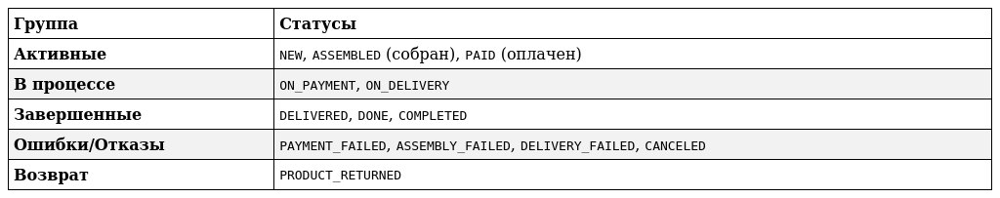

# Модуль Order: Управление заказами

 📝 Общее описание
Order — это микросервис для управления заказами в экосистеме интернет-магазина. Модуль обеспечивает полный цикл работы с заказом: от момента формирования корзины до финальной доставки и обработки возможных возвратов.

---

 ✨ Основные функции

 📦 Управление заказами
• Создание заказа: Оформление новых заявок в системе.
• Финансы: Расчёт итоговой стоимости, стоимости товаров и интеграция с оплатой.
• Логистика: Расчёт стоимости доставки, контроль сборки и отгрузки.
• История: Получение истории заказов пользователя.
• Возвраты: Полная обработка процесса возврата товаров.

 🚦 Контроль состояний
•  Отслеживание текущего статуса заказа в реальном времени.
•  Управление жизненным циклом заказа через переходы между состояниями.
•  Отказоустойчивость: обработка ошибок на каждом этапе бизнес-процесса.

---

 ⚙️ Бизнес-логика

 Статусы заказа
Процесс заказа описывается следующими состояниями:

### Структура данных
Заказ включает в себя:
•  Идентификаторы: ID заказа, ссылки на корзину, доставку и оплату.
•  Состав: Список товаров и их количество.
•  Физические параметры: Вес, объём, признак хрупкости (для расчёта логистики).
•  Цены: Стоимость товаров, стоимость доставки и итоговая сумма.

---

 🔌 Взаимодействие и интеграции
Сервис интегрирован со следующими компонентами системы:
- Клиенты: Веб и мобильные приложения.
- Внешние системы: Платёжные шлюзы и сервисы курьерской доставки.
- Инфраструктура: 
  - Eureka — регистрация и обнаружение сервисов.
  - Config Server — управление внешними конфигурациями.

---

 🛠 Технические требования
•  Конфигурация: Поддержка внешней конфигурации и автоматическая загрузка параметров при старте.
•  Service Discovery: Обязательная регистрация в Eureka.
•  Надежность: 
  - Строгая валидация входящих данных.
  - Централизованная обработка исключений.
  - Подробное логирование всех бизнес-операций.

---

 🚀 API Методы
Основные эндпоинты поддерживают следующие операции:
1. POST /create — создание заказа.
2. POST /pay — инициация оплаты.
3. GET /calculate — расчёт стоимости.
4. GET /list — получение списка заказов.
5. PATCH /status — обновление статуса.
6. POST /return — оформление возврата.

> [!TIP]
> Полная спецификация API в формате OpenAPI доступна в файле: order.json.